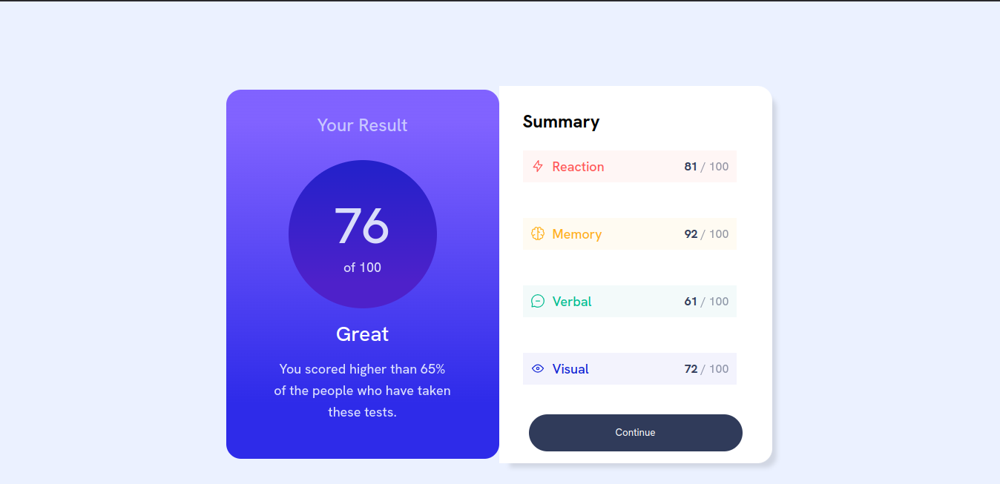

# Frontend Mentor - Results summary component solution

This is a solution to the [Results summary component challenge on Frontend Mentor](https://www.frontendmentor.io/challenges/results-summary-component-CE_K6s0maV). Frontend Mentor challenges help you improve your coding skills by building realistic projects. 

## Table of contents

- [Overview](#overview)
  - [The challenge](#the-challenge)
  - [Screenshot](#screenshot)
  - [Links](#links)
- [My process](#my-process)
  - [Built with](#built-with)
  - [What I learned](#what-i-learned)
  - [Continued development](#continued-development)
- [Author](#author)

## Overview

### The challenge

Users should be able to:

- View the optimal layout for the interface depending on their device's screen size
- See hover and focus states for all interactive elements on the page
- **Bonus**: Use the local JSON data to dynamically populate the content

### Screenshot




### Links

- Solution URL: [Add solution URL here](https://github.com/rajin-siam/Results-summary-component)
- Live Site URL: [Add live site URL here](https://rajin-siam.github.io/Results-summary-component/)

## My process

### Built with

- Semantic HTML5 markup
- CSS custom properties
- Flexbox
- Mobile-first workflow


### What I learned

I got a bit idea of how to use gradient. Besides this I also got an important idea about flexbox.
Changing flex-direction alters the main and cross axes. Flexbox properties like justify-content and align-items still work but adjust based on the new axes. So if you change axis then you have to adjust child elements axis as per your requirement.

To see how you can add code snippets, see below:


```css
.stats-container{
    display: flex;
    flex-direction: column;
    gap: 1 rem;
    border-radius: 15px;
}


.stat {
    display: flex;
    align-items:center;
    justify-content:space-between;
    margin: 1.5rem 2rem;
    flex-direction: row;    /* the main magic  */
    width: 288px;
    padding: 10px 10px;
}
```


### Continued development

We will add javascript in this project to create dynamic web page.


## Author

- Website - [Md. Rajin Mashrur Siam](https://rajin-siam.github.io/Portfolio/)
- Frontend Mentor - [@rajin-siam](https://www.frontendmentor.io/profile/yourusername)
- LinkedIn - [md-rajin-mashrur-siam](https://www.linkedin.com/in/md-rajin-mashrur-siam/)


